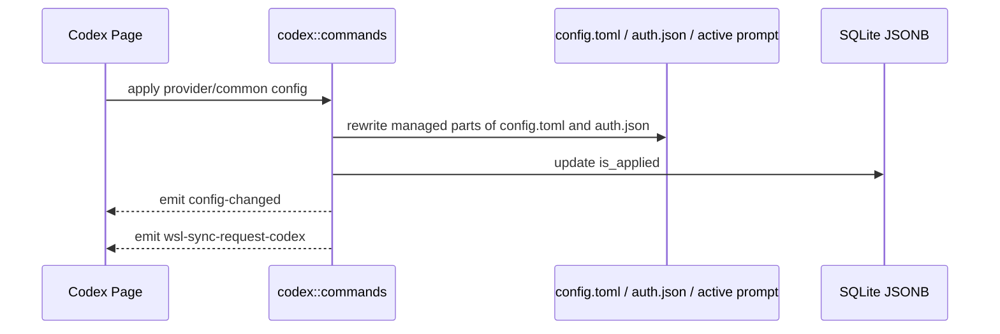

# Codex 后端模块说明

## 一句话职责

- `codex/` 负责 Codex provider/common config、`config.toml`、`auth.json`、prompt、plugin、官方账号与 memories 记忆文件相关运行时文件。

## Source of Truth

- Provider、common config、prompt config、official account 和 plugin workspace roots 的长期主数据在 SQLite JSONB；旧 SurrealDB 仅用于启动时一次性导入。

- 当前生效根目录优先级是：应用内 `root_dir` > 环境变量 `CODEX_HOME` > shell 配置 > 默认根目录。
- Codex 是“根目录模块”，`config.toml`、`auth.json`、prompt、`skills/` 都从当前根目录派生。历史同步目标由命令层解析 Codex history source：会话管理来源为 `all` 时默认本机优先，当前根目录是 WSL Direct 时只处理该 WSL root。
- prompt 的运行时事实源是当前根目录下的 Codex active global prompt 文件，而不是数据库记录本身。当前按 upstream 语义选择：非空 `AGENTS.override.md` 优先，否则使用非空 `AGENTS.md`；两者都为空时写入目标优先保持已存在的 `AGENTS.override.md`，否则使用 `AGENTS.md`。

## 核心设计决策（Why）

- `config.toml` 不能靠字符串拼接合并 common/provider 配置，必须结构化 merge，避免顶层键被吞进 provider 表作用域。
- common config 是供应商共享默认值，provider 显式配置必须在应用时覆盖 common。入库拆分只能删除与 common 值相同的重复项，不得仅因字段同名就删除不同值；尤其要保留 provider 自己的 `model`、`model_reasoning_effort` 和 provider table 字段。
- `auth.json` 与 `config.toml` 混有 Codex runtime 自有字段；AI Toolbox 只能改受管字段，不能整文件覆盖运行时状态。
- `apply_config_internal` 统一负责写文件、更新 `is_applied`、发 `config-changed` 和 `wsl-sync-request-codex`。
- Codex 官方订阅的模型下拉来源是共享模型目录，而不是 Codex 本地账号文件。远程目录不可用时使用内置兜底；账号 quota/plan 只影响可用性判断，不应阻断 provider 表单读取模型列表。
- 当 provider 表为空、当前 Codex root 没有 API key / base_url 这类三方本地配置，并且本地 `auth.json` 有有效官方登录态时，启动初始化和 provider 列表懒加载会自动创建持久化 official 默认 provider；新建 provider 必须使用新的 `codex_provider` id，不复用 official account 记录里的 `provider_id`。
- 启动初始化和 provider 列表懒加载必须使用同一套 official-only 判断；如果本地同时存在官方登录态和三方 `base_url` / API key 配置，应保留 `__local__` 临时 provider 语义，不要在启动阶段持久化默认 provider。
- `__local__` 临时 provider 只用于三方/自定义本地配置。不要把纯官方订阅本地运行态显示成 `default（来自本地）`，否则用户删除持久化官方订阅后会看到无法删除的官方订阅临时卡片。
- official account 命令必须区分 `provider_id == "__local__"` 和 `account_id == "__local__"`：前者是临时 provider，后端必须拒绝 OAuth/apply/delete/refresh/copy 等 official-account 管理入口；后者是在真实持久化 official provider 下展示本机运行时登录态的虚拟账号。
- Official OAuth freshness: apply 路径已有 `ensure_fresh_official_runtime_auth`（lead 3 天）。启动 / 周期巡检由 `coding::auth_refresh` 调用 `refresh_applied_codex_accounts_if_needed`（所有已入库官方账号，排除 `__local__` 虚拟账号；默认 interval 12h）。未应用账号只把新 token 写回 SQLite；**仅 applied** 才写 live `auth.json`，写后须 `config-changed` + `wsl-sync-request-codex`（与 apply 对齐）。额度 `wham/usage` 不进该调度器。

## 关键流程

## 易错点与历史坑（Gotchas）

- Codex 无可委托的 `plugin marketplace add` CLI（不像 Grok/Claude 委托各自 CLI）。远程市场源（git 仓库 URL / GitHub `owner/repo` 简写 / `marketplace.json` 直链）由后端 `plugin_workspace::add_codex_plugin_workspace_root` 自行处理：git 源克隆到 `<codex_root>/.tmp/plugin-marketplaces/<id>`、JSON 源仅下载 `marketplace.json` 到该目录的 `.agents/plugins/`，再注册为 workspace root。LocalWindows 复用 `coding::skills::git_fetcher::clone_or_pull`（含代理 env + 超时）；WslDirect 走 `wsl -d <distro> --exec env <proxy> git clone` 到 Linux 路径、注册 UNC 等价路径。`marketplace.json` 直链仅下载单文件，插件可列但不可装（`source: { Local }` 相对路径无对应目录）。重复添加同一 URL 命中同一 `<id>` 缓存目录，触发 fetch+reset 刷新而非重建。删除 workspace root 时若路径位于受控缓存目录下，顺手清理克隆/下载的缓存。
- `extract_codex_common_config_from_current_file` 只能读当前根目录下的 `config.toml`，禁止复用 `read_codex_settings_from_disk`（会先读无关的 `auth.json`）。提取逻辑不需要 auth；WSL UNC / 网络路径上 `Path::exists` / `fs::read_to_string` 可能长时间阻塞，文件 I/O 必须走 `coding::file_io`（`spawn_blocking` + 超时），超时错误文案要带上实际路径。
- 不要对 `config.toml` 做纯文本拼接。遇到 table 合并必须走结构化 TOML merge。
- 改写 `config.toml` 时要显式保留 runtime-owned sections，例如 `mcp_servers`、`plugins`。`[features]` 不是整段保护；普通 feature key 可以由 provider/common config 管理，但 `features.plugins` 属于插件页/运行时开关，必须保留当前 live 文件里的值，不能被 provider/common config 覆盖。
- Codex 插件批量启用/禁用只作用于当前 runtime 下真实已安装插件。全启用会确保 `[features].plugins = true`；全禁用只把各插件 `enabled = false`，不要顺手关闭 plugins feature，否则会把“逐插件状态”和“全局插件功能开关”混成两个不可解释的状态。
- 改写 `auth.json` 时不要覆盖运行时 OAuth 字段；AI Toolbox 只应管理自己负责的 auth 键。
- 当 `codex_preserve_official_auth_on_switch=true` 且应用第三方 provider 时，第三方 API key 的运行时投影只能写入当前 `model_provider` 指向的 `[model_providers.<id>].experimental_bearer_token`，不能写顶层 `experimental_bearer_token`，因为 Codex runtime 不读取顶层 bearer token。缺少有效 `model_provider` 或对应 provider 表时应拒绝应用，避免跳过 `auth.json` 后生成无可用第三方凭据的运行态。provider 存储仍以 `settings_config.auth.OPENAI_API_KEY` 为主数据；保存/导入 live config 时要把 provider-scoped `experimental_bearer_token` 回填到 auth 并从存储 TOML 清掉，旧 managed 快照也必须包含这个生成字段，确保关闭开关或切回官方时不会残留。
- 改会影响 live 投影方式的设置（例如 `codex_preserve_official_auth_on_switch`）时，不能只写 SQLite：必须立刻重投影当前已应用渠道。统一走 `proxy_gateway::provider_switch::apply_or_switch_provider`——未接管则直接 apply；Gateway 已接管则 restore 直连 → apply → 再 engage single，原先是 failover 再开 failover。不要只 `save_settings`，也不要在前端拼 restore/engage。失败要回滚设置（对齐 `set_codex_unified_session_history`）。专用入口：`set_codex_preserve_official_auth_on_switch`。
- WSL 自动同步是事件驱动，不是“数据库写成功就等于已经同步到 WSL”。
- 删除 prompt 配置只删 SQLite 记录，不改写/清空当前 active prompt 文件。产品语义是“删除已保存的提示词记录”，不是“清空本地 runtime 提示词”；Claude Code / OpenCode / Grok / Gemini / Pi 统一此规则。若用户要改本地生效内容，应通过编辑/应用其他 prompt 或直接改 active prompt 文件。
- Codex prompt 同步必须按一组文件镜像：`AGENTS.md` 与 `AGENTS.override.md` 存在就同步，不存在就清理远端同名文件。不能只同步 active 文件，否则从 override 切回默认时远端会继续读取旧 override。
- 禁用已应用 prompt 必须清空当前 root 下两种已存在的 prompt 文件，再清除 DB applied 标记并发同步事件，保留数据库内容和已有文件名供重新应用；只清空 active override 会让旧 `AGENTS.md` 按上游回退规则重新生效。
- 普通“新建 provider”和“复制已应用 provider”都属于创建新记录，默认不应自动应用；不要因为源 provider 当前已应用，就把新记录写成 `is_applied = true`。
- `save_codex_local_config` 里的 `__local__` 不是普通新增 provider，而是把当前生效的本地运行时配置正式收编入库；在这个产品语义下，它保持 `is_applied = true` 是合理的，不要把这条链路误修成“保存但取消应用”。
- `save_codex_local_config` 收编 `__local__` 时仍要保留 provider `meta`，包括 Gateway 计费配置里的 `costMultiplier` / `pricingModelSource`；不要只保存 settings/common 而把表单提交的 meta 丢成 `None`。
- `adapter::to_db_value_provider` 是 Codex provider 持久化的最后一道写库入口；新增或调整 provider 级扩展字段时必须确认它也写入 JSONB。尤其 Gateway 计费 `meta` 不能只在 command 层结构体里保留，否则页面保存后重新 list 会丢失。
- 官方账号额度来自 Codex usage windows，后端负责按窗口语义解析并持久化 `5h`、weekly、monthly；前端只展示后端投影结果，不自行按套餐或字段顺序推断窗口类型。
- 拉取官方账号额度时必须带 `Chatgpt-Account-Id`，否则多账号/组织账号可能拿错 usage；解析 usage 时同时检查顶层 `rate_limit` 和 `additional_rate_limits`，monthly 这类窗口可能出现在 additional rate limits 中。
- 官方模型目录按 CLIProxyAPI 的 Codex plan 语义选择 `free/team/plus/pro` tier；未知 plan 默认按 `pro` 处理，并补入 Codex 内置模型 `gpt-image-2`。
- 当前官方模型目录只服务 AI Toolbox 页面下拉框，不等于 Codex runtime 的 `model_catalog_json`。自定义 Codex provider 可通过 `settingsConfig.modelCatalog.models` 保存简化模型映射；后端应用 provider 时会在当前 Codex root 下生成 `ai-toolbox-codex-model-catalog.json`，并在 `config.toml` 顶层写入相对文件名 `model_catalog_json = "ai-toolbox-codex-model-catalog.json"`。Gateway aggregate 复用同一 catalog 文件，但只有 aggregate manifest 拥有该 pointer；catalog/pointer 应用失败必须恢复原 runtime 并写回 disabled manifest。退出 aggregate 或直接切回 single 时，必须先由原始 manifest backup 恢复用户外部 pointer（原本无值则删除），再生成 single snapshot。清空映射或切到官方 provider 时，只移除指向该 AI Toolbox 自有文件名的字段；不要覆盖或删除用户自有的外部 catalog 配置。
- Gateway aggregate 的 `aggregate.groups` 非空时，Codex catalog 与 runtime 必须使用同一套严格命名：`<group_id>.<upstream_model>`（固定字面 `.`，即 `group.model` 形状），不得套用 legacy aggregate 的 `separator`、`aliases` 或 `naming` 模板。组内 `provider_ids` 顺序就是该模型入口的唯一 failover 顺序；禁止跨 group 或落到未分组 provider。provider 可被多个 group 复用，但同一 group 不得重复，group id 忽略大小写唯一且每组至少一个可代理 provider。**只有** `groups` 缺失或 `[]` 才是兼容边界，必须继续使用旧的站点/模型 catalog slug 与 legacy aggregate fallback；不要把两种语义混写成一个“aggregate failover”。
- `settingsConfig.config` 的默认 `model` 与 `settingsConfig.modelCatalog.models` 相互独立。后端只用 catalog 生成模型目录，不得用 catalog 第一项推断或改写默认 `model`。
- `settingsConfig.modelCatalog.models` 里的能力元数据必须和模型映射一起保存。`supportsImage=false`、`vision=false`、`attachment=false`、`modalities.input` 不含 `image` 会被 Gateway runtime 用来做发送前 text-only 图片替换；后端 storage normalize 不能只保留 `model/displayName/contextWindow`，否则真实 provider 保存后会丢失预测式图片兼容依据。
- 生成 `ai-toolbox-codex-model-catalog.json` 时，每条 entry 的 `context_window` / `max_context_window` 优先用显式填写的 `modelCatalog.models[].contextWindow`；未填则取 `config.toml` 顶层 `model_context_window`；再没有时用 `CODEX_DEFAULT_CONTEXT_WINDOW = 272_000` 兜底（对齐 `codex-rs/models-manager/models.json` 内置值），不能改回旧硬编码 128_000——否则会把 gpt-5 系列等模型的 `/status` 上下文错误压成 128k。未设 override 时不写该文件；Catalog entry 不存在这两个字段时 Codex 会按 `Option<i64> = None` 优雅降级（无硬上下文上限），但本项目的选择是写出 272_000 让 Codex 显式生效。**DeepSeek 官方 mirror 例外**：当 `config.toml` 的 `wire_api`/`api_format` 解析为 `responses`（native `/responses`）且 `base_url` 的 URL host 命中 `deepseek.com`（精确或 `.deepseek.com` 子域）时，整条兜底链被绕过——生成的 catalog 镜像内置的 `tauri/resources/codex_deepseek_catalog_template.json`（DeepSeek 官方 models.json：freeform `apply_patch`、GPT-5 harness、1m context、text-only modalities）。此时未显式填写的 `contextWindow` 保留官方 1m（`1_048_576`），`displayName` 未显式填写时保留官方显示名；`spec.display_name` / `spec.context_window` 以 `Option` 承载"用户是否显式填写"，以区分官方值与默认兜底。wire_api/base_url 的解析必须复用 `provider_protocol::codex_wire_api_from_config` / `codex_base_url_from_config`（含 active 表 → 根级 → 首 provider 表的回退链），禁止在本模块另写一套更窄的 TOML 解析，否则 catalog 判定会与 Gateway runtime 的 native Responses 判定分叉。host 判定必须按解析出的 URL host 精确匹配，不能 `contains("deepseek.com")` 子串匹配（避免 `deepseek.com.evil.example` 之类误授官方能力）。非 `deepseek.com` host 或非 Responses target（chat/anthropic）仍走 neutral 模板。
- 自定义 provider 的 `settingsConfig.autoReviewModelOverride` 是 **provider 级单值**，不是模型映射行字段。应用时后端会把它统一写入 `ai-toolbox-codex-model-catalog.json` 中每条 entry 的 `auto_review_model_override`（默认全量，不提供“仅当前”选项）。仅当用户显式填写非空值时写入；不要默认填自身。Codex 只读当前会话 model 的 catalog 元数据，因此有 override 时还必须保证默认 `model` 在 catalog 中：无 mapping 则种子一条；有 mapping 但默认 model 缺失则自动补一条。官方 provider 不保存/不投影该字段。
- Per-model service (speed) tiers: `settingsConfig.modelCatalog.models[].serviceTiers` stores bare canonical tier ids (`"priority"` = Fast, `"ultrafast"` = Ultrafast). Only these two ids are recognized; unknown values are dropped at catalog-generation time so a typo can never produce a tier Codex would reject. The catalog generator expands each id to a full `{ id, name, description }` object via `CODEX_SERVICE_TIER_ENTRIES` (mirrors `codex-rs/models-manager/models.json` verbatim — verified against the official `gpt-5.6-sol` entry). When the spec declares tiers they replace the entry's `service_tiers`; when omitted the neutral template writes an empty array `[]` (no tier advertised — the safe default, matching cc-switch, so a third-party provider never falsely claims a priority tier it does not honor). The official DeepSeek vendor mirror path only writes `service_tiers` when the user explicitly opts in; otherwise the vendor entry is kept verbatim (DeepSeek entries carry no `service_tiers` array, so codex sees no fast mode unless the user opts in). No `default_service_tier` field is written — the official catalog also leaves it `None` on every model, so fast mode never auto-enables; the user must opt in. Do NOT add `"flex"` to the tier whitelist: Codex's `ServiceTier` enum defines `Flex` (request value `"flex"`), but zero official models declare it in their `service_tiers`, so advertising it would let users select a tier the upstream catalog never grants. Legacy `additional_speed_tiers` is deprecated upstream and intentionally not written. Storage normalize preserves `serviceTiers` (camelCase only, DB is the SSOT); non-empty arrays only, so storage stays compact and round-trips cleanly. Runtime chain when debugging "fast mode not working": catalog `service_tiers[].id` declaration → Codex `Feature::FastMode` enabled → user-side tier selection (config.toml top-level `service_tier` or the TUI fast-mode toggle) → `service_tier_for_request` filters against the declared ids → the selected string is passed verbatim into the Responses API `service_tier` param; a catalog declaration alone is necessary but not sufficient.
- Generated catalog `shell_type` must be `unified_exec`, never the legacy `shell_command`. Codex #39757/#39772 (2026-08-20, "Standardize shell execution on unified exec") removed the standalone `shell_command` runtime and demoted the value (plus `default`/`local`) to serde aliases of `ConfigShellToolType::UnifiedExec`; the only other variant is `Disabled`. The official models.json migrated all selectable models to `unified_exec` (only the internal `gpt-daybreak-blue/red-latest` experiment entries still declare `shell_command`), so both the neutral template (`codex_model_catalog_entry`) and the defensive backfill (`fill_template_fields_from_static`) write `unified_exec`. Exception: `tauri/resources/codex_deepseek_catalog_template.json` entries keep the `shell_command` they ship with — that file mirrors DeepSeek's officially published models.json verbatim, and both old and new CLIs parse the value (new CLIs treat it as the alias, identical behavior). Do not expose per-model `shell_type` UI: the legacy value has no independent semantics anymore and `Disabled` (no shell tool registered) is not a real third-party-provider use case. Source: issue #305 user confusion caused by the outdated `shell_command` value.
- Codex 历史同步会直接修改选定 history source 下的 runtime 私有状态：`state_5.sqlite`、`session_index.jsonl` 和 `sessions/**/rollout-*.jsonl` 首行 metadata。必须先备份，默认只修复 provider 路由，不改写 `model` 或 `cwd`，恢复最新备份前必须再创建 `pre-restore` 安全备份。`all` 这种列表来源不能被解释成同时同步本机和 WSL；写操作必须先解析成单一 Codex root。
- 历史同步读写 `state_5.sqlite` 时必须带 busy timeout，并对 `database is locked` / busy 做统一重试。`get_status` 打开弹窗就会读库，不能只在写路径重试；WSL/VS Code 远程场景下 Codex 持锁更常见。重试耗尽后的错误文案要可操作（结束当前回复/关闭 Codex 后再试），前端应对 locked 错误做本地化，不要直接抛原始 SQLite 字符串。
- 统一 Codex 会话历史只应让官方 provider 的 live `config.toml` 注入共享 `custom` history bucket，并保持 `auth.json` 官方登录态不变；注入段不能进入 provider 存储主数据。存量迁移只能按窄边界执行 `openai -> custom`，恢复只能按迁移账本把当初迁入的官方 session/thread 改回 `openai`，不能猜测开启期间新产生的 `custom` 会话来源。
- `read_codex_settings_from_disk` 读路径必须自愈悬空 `model_provider`：当顶层 `model_provider = "<id>"` 指向的 `[model_providers.<id>]` 表不存在时，就地删除该字段并落盘，`log::warn` 记录修复。入口是 `heal_dangling_codex_model_provider`。来源 issue #311：旧版网关接管（commit `43a8fd83` 之前）写入 `model_provider = "ai-toolbox-gateway"` + 对应表，升级或跨副本改写后表丢失但字段残留，Codex CLI 加载 config.toml 时硬性校验 `model_provider` 必须有对应表，否则报 `Model provider 'ai-toolbox-gateway' not found` 并拒绝启动对话。读路径是覆盖面最广的兜底，无论悬空态由手动编辑、部分迁移还是跨副本同步产生都能自愈；网关 `restore_codex_config` 只在主动恢复直连时清理 legacy sentinel，不能替代读路径自愈。自愈只删悬空字段让 Codex 回退默认 provider，不猜测/重建 provider 表（那需要 DB 里的 provider 信息，超出读路径职责）；空/不可解析的 config 不修复，原样返回让 Codex 自己报错；runtime-owned section（如 `mcp_servers`）必须原样保留。
- memories 管理（`codex/memories.rs`，issue #296）是 `<codex_root>/memories/` 的通用文件浏览器：不同 Codex 版本的 memories 目录结构不同（`MEMORY.md`、`memory_summary.md`、`raw_memories.md`、`rollout_summaries/`、`skills/`、`extensions/ad_hoc/notes/`、`.git` 工作区），后端与 UI 都不能硬编码文件名白名单。
- memories 的 local/wsl 来源复用历史同步的 `resolve_codex_history_source_candidates`（为此已把该函数与 `CodexHistorySourceCandidate`/`CodexHistoryRuntimeSource` 放宽为 `pub(super)`）：当前 root 是 WSL Direct 时只有 WSL 来源；本机 root 时 WSL 来源要求 WSL sync 配置已启用且能解析 distro home。memories 不属于 WSL 自动同步与 `config-changed` 事件范围，面板直接经 UNC 读写所选来源，不发光同步事件。
- `list_codex_memories` 在请求的来源不存在时不报错：返回 `unavailable=true` + 完整 `availableSources` + 空列表，让前端能自动切换到可用来源（WSL-only 环境首次加载 `local` 必须能降级到 `wsl`，否则 UI 死锁在禁用态）。其余写操作对不可用来源直接报错，由 UI 禁用入口兜底。
- 来源存在但 `memories/` 尚未生成时，根目录列表返回空列表且不创建磁盘目录，保留 `availableSources`；只有缺失的子目录仍报错。新建文件必须经 `create_new` 原子创建，重名不得截断旧内容；编辑保存沿用覆盖语义。重命名的单文件名也必须拒绝冒号，避免 Windows 盘符相对路径逃出 memories root。
- 所有 memories 相对路径必须通过 scope 校验：拒绝 `..`、绝对路径/盘符/冒号、`.` 开头隐藏组件与 symlink 穿越（对齐 Codex 自身 `resolve_scoped_path` 语义）；盘符与分隔符要显式拒绝，否则非 Windows 平台会把 `C:\x` 当普通文件名放行。文件 I/O 必须在 `spawn_blocking` + 超时内执行，错误文案带实际路径并提示 WSL/网络路径排查方向。
- `clear_codex_memories` 对齐上游 `clear_memory_roots_contents`：清空 `memories/` 与 `memories_extensions/` 全部内容、保留目录本身、拒绝 symlink root；但刻意保留 `.git/` 等隐藏顶层条目，避免破坏 consolidation 基线导致 Codex 重建整个 workspace 历史。这是与上游 clear（连 `.git` 一起删）的有意偏差。
- memory 文件读取有 2 MiB 上限；`rollout_summaries/`、`raw_memories.md`、`MEMORY.md`、`memory_summary.md` 是 Codex 内部 DB/consolidation 的重建产物，手动删除后可能被重写——UI 有提示文案，后端不做 DB 级清理（私有 schema，跨版本不稳定）。

## 跨模块依赖

- 依赖 `runtime_location`：统一得到根目录、`config.toml`、`auth.json`、prompt、skills 路径与 WSL 目标路径。
- 被 `web/features/coding/codex/` 依赖：页面通过 `get_codex_root_path_info()` 和 provider/prompt API 管理状态。
- 被 `wsl/`、`ssh/`、`mcp/` 间接依赖：它们都受 `config.toml` 路径和保留段语义影响。

## 典型变更场景（按需）

- 改 `config.toml` 落盘逻辑时：
  同时检查结构化 merge、runtime-owned sections 保留、WSL 同步事件和最小回归测试。
- 改 root_dir 逻辑时：
  同时检查 `auth.json`、`config.toml`、active prompt、Skills 路径、历史同步目标和前端 path info 展示。
- 改会影响 live 投影的设置/开关时：
  写设置后必须重投影当前已应用渠道，统一复用 `apply_or_switch_provider`（直连直接 apply；Gateway 下 restore → apply → re-engage）。参考 `set_codex_preserve_official_auth_on_switch`。

## 最小验证

- 至少验证：common/provider 合并后顶层键仍在根级，表结构未错位。
- 至少验证：编辑已应用配置后仍会发出 `wsl-sync-request-codex`。
- 至少验证：prompt 应用会改写当前根目录下的 active prompt 文件。
- 至少验证：存在非空 `AGENTS.override.md` 时，prompt 读取、应用、删除和 WSL/SSH 动态映射都作用于 `AGENTS.override.md`，且切回 `AGENTS.md` 时远端 stale override 会被清理。
- 改历史同步时，至少验证本机/WSL source 解析、新旧 `threads` schema、session 首行 metadata 往返、`session_index.jsonl` 重建、pre-sync 备份和恢复最新备份。
- 改统一会话历史时，至少验证 official config 注入/剥离、冲突 `custom` provider 跳过、`openai -> custom` 迁移、账本恢复和 Gateway 接管期间拒绝切换。
- 改 `codex_preserve_official_auth_on_switch` 时，至少验证：已应用第三方渠道下开关切换后 live `auth.json`/`config.toml` 立即按新投影更新；Gateway 接管时走 restore → apply → re-engage；失败时设置回滚。
